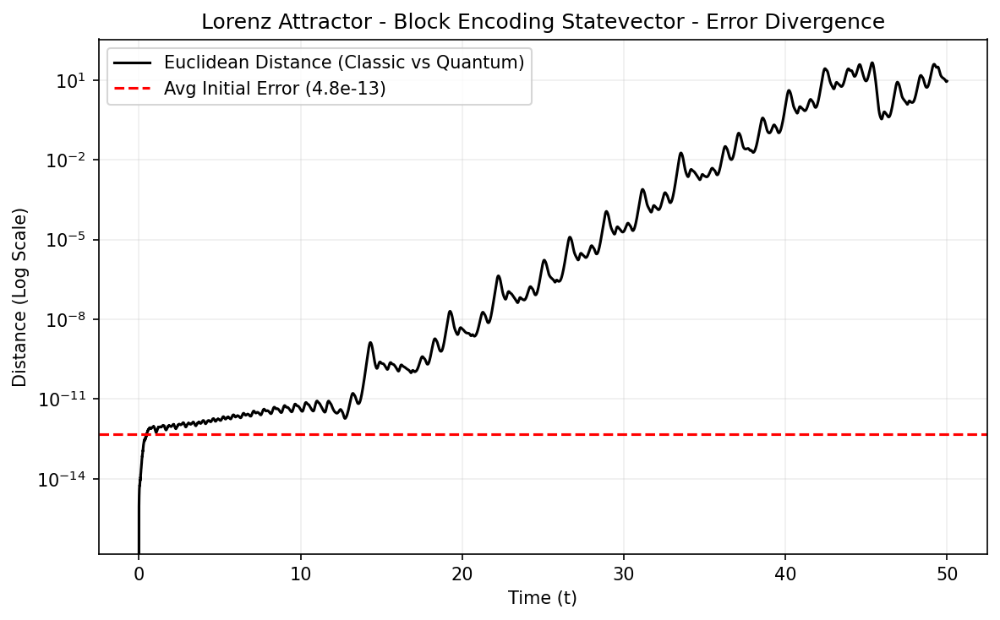

# Quantum Solvers for Nonlinear Dynamical Systems

This repository implements quantum algorithms for solving nonlinear ordinary differential equations (ODEs), with a focus on high-fidelity simulation of the **simple pendulum** and the **Lorenz system**.

---

## 🔬 Implemented Methods

| Method | Target System | Statevector | Measurements |
| :--- | :--- | :---: | :---: |
| **Linear Combination of Unitaries (LCU)** | Pendulum (Linear & Nonlinear) | ✅ | ✅ |
| **Unitary Rotation Gates** | Pendulum (Linear & Nonlinear) | ✅ | ✅ |
| **Standard Block Encoding** (`sqrtm`) | Lorenz System | ✅ | ✅ |
| **Pauli-LCU** (Householder Prep) | Lorenz System | ✅ | ✅ |
| **Sparse FABLE** (S-FABLE) | Lorenz System | ✅ | ✅ |
| **FABLE** | Lorenz System | ✅ | 🔲 |

---

## 📂 Repository Structure

```text
Nonlinear-Equations-Quantum-Solver/
├── pendulum/                   # Pendulum dynamics solvers
│   ├── classical.py            # Reference solutions (Euler, RK4, Analytical)
│   ├── plot_results.py         # Standardized 2-panel visualizations
│   ├── pauli_lcu_linear/       # Linear case via LCU
│   ├── pauli_lcu_nonlinear/    # Nonlinear case via LCU + ω²_eff
│   ├── rotations_linear/       # Linear case via 1-qubit Ry rotations
│   └── rotations_nonlinear/    # Nonlinear case via Hybrid Rotations
│
├── lorenz/                     # Lorenz system solvers
│   ├── classical.py            # Forward Euler reference
│   ├── plot_results.py         # 3D Trajectory + Error Log plots
│   ├── block_encoding/         # Standard BE routines
│   ├── pauli_lcu/              # Optimized Pauli-LCU with Phase-Prep
│   ├── sfable/                 # Sparse FABLE implementations
│   └── fable/                  # Legacy FABLE solver
│
├── Makefile                    # Execution automation
├── requirements.txt            # Project dependencies
└── README.md
```

---

## 🚀 Quick Start

```bash
# 1. Install dependencies
pip install -r requirements.txt

# 2. Run an optimized pendulum solver
python -m pendulum.pauli_lcu_linear.pauli_lcu_linear_statevector

# 3. Run the latest Lorenz solver (Pauli-LCU)
python -m lorenz.pauli_lcu.pauli_lcu_measurements

# 4. Use Automation (Make)
make run-all-sv   # Run all statevector simulations
make figures      # Regenerate all project figures
```

---

## 💡 Key Results & Insights

### 1. The Post-Selection Decay
The **LCU statevector** simulation reproduces the classical forward-Euler discretisation *exactly*, validating the circuit construction. However, the **measurement-based** simulation inevitably diverges. This is due to the cumulative effect of the post-selection probability $P_{succ} < 1$: after $n$ steps, the state norm decays as $(\sqrt{P_{succ}})^n \to 0$, leading to amplitude starvation.

### 2. Hybrid Rotation Methodology
Because pure quantum rotations strictly conserve the geometrical norm $x^2 + y^2 = 1$, they cannot naturally describe the anharmonic potential of a physical pendulum using a single qubit without ancillas.
- **Linear**: Naturally matches the circular phase space, conserving amplitude intrinsically.
- **Nonlinear**: Implements a **hybrid quantum-classical algorithm**: the amplitude stretch (non-unitary factor) is tracked classically while the geometrical phase angles are mapped onto the `Ry` unitary gates.

---

## 🦋 Análisis de Divergencia Caótica (Lorenz)

The block-encoding solver for the Lorenz system illustrates the propagation of computational noise in chaotic regimes. By mapping the Euclidean distance $d(t)$ on a logarithmic scale, we observe:



1. **Initial Fidelity**: Error rests at the noise floor ($\sim 10^{-13}$), validating the precision of the `sqrtm` protocol.
2. **Lyapunov Divergence**: Starting at $t \approx 13$, truncation and floating-point errors compound exponentially. The constant-slope linear ascent in the log plot is a direct visual proof of the system's **positive Lyapunov exponent**.
3. **Saturation**: Approaching $t = 40$, divergence reaches a limit imposed by the finite geometric topology of the "butterfly" strange attractor.

---

## 🕳️ The Origin Trap (Trampa de Estado Absorbente)

During QST Measurement-based Block Encoding, we observed a phenomenon called an **Absorbing State Trap**. 

Because algorithms like Carleman Embeddings require padding the vector with nonlinear cross terms, the fundamental physical probabilities for $x, y, z$ suffer from **Amplitude Starvation**. Under finite statistical discretization (e.g., 20,000 shots), any chaotic crossing close to zero mathematically rounds to exactly $0$ counts. 

Since $(0,0,0)$ is a saddle-point equilibrium of the Lorenz equations, truncating to absolute $0.0$ permanently zeroes the differential matrix, trapping the system at the origin.
**Mitigation:** We implement a $10^{-6}$ stochastic **Microscopic Dithering** to preserve the continuous topology on discrete quantum hardware.
