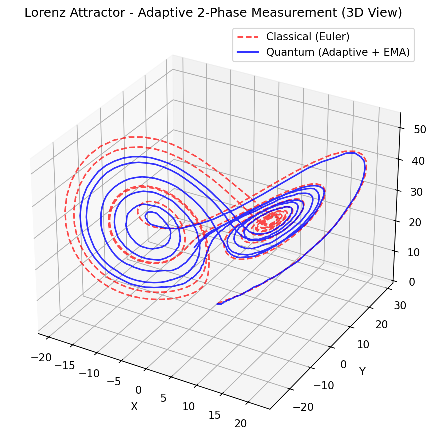
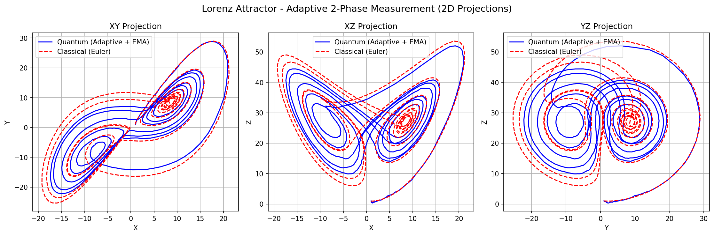
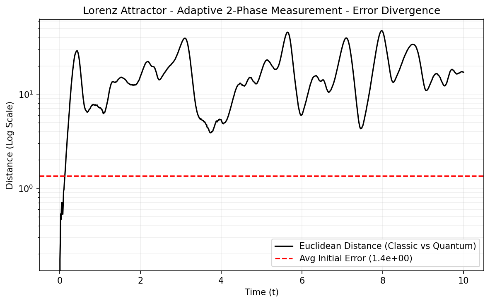
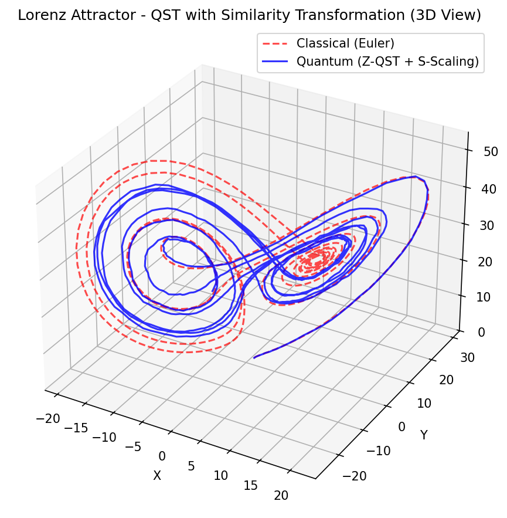
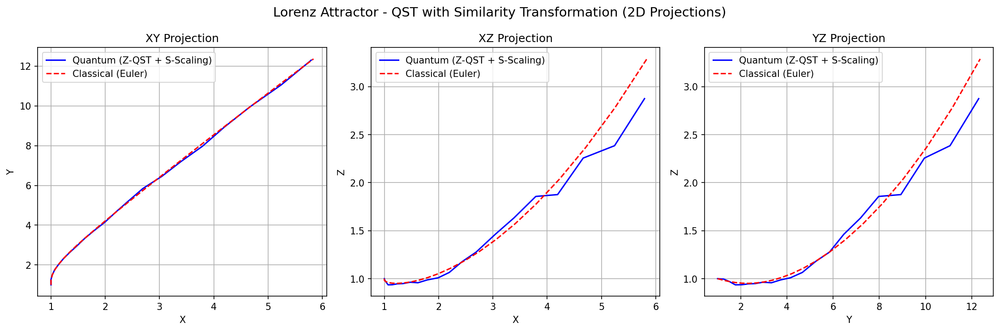
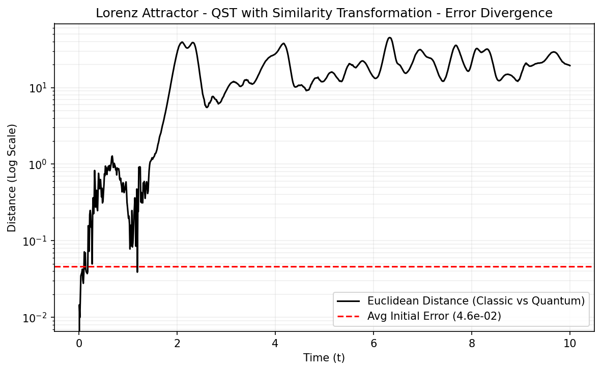

# Block Encoding Solvers

This folder contains solvers that implement the standard analytical Block Encoding framework using the `sqrtm` method for the linearized Lorenz system.

## Solvers Included

### 1. Measurements (`block_encoding_measurements.py`)
This solver is tailored for **NISQ-era hardware**. It models physical execution by utilizing stochastic Z-basis measurements. 
- **Stochastic Sampling**: Amplitudes are estimated through probability distributions ($\sqrt{P} \propto \text{amplitude}$), exhibiting $\mathcal{O}(1/\sqrt{N_{shots}})$ scaling.
- **Origin Trap Resilience**: Avoids constant zero-padding to keep probability mass concentrated on dynamic variables.
- **Sign Reconstruction**: Uses classical Eulerian inertia to recover the sign information lost during measurement.

### 2. Statevector (`block_encoding_statevector.py`)
This solver provides the **ideal algebraic limit** of the quantum evolution.
- **Noise-Free**: Bypasses sampling noise and hardware constraints by directly reading amplitudes from the simulation's statevector.
- **Baseline Validation**: Serves as the ground-truth benchmark to verify that the Carleman linearization and Block Encoding mapping correctly preserve the chaotic attractor.

## Operation Principle
Both solvers utilize a similarity scaling transformation (Similarity matrix $S$) to map the physical coordinates into a scaled Hilbert space where the propagator $A$ is effectively block-encoded into a unitary operator $U$. The evolution corresponds to applying the unitary $U$ to the current state and post-selecting on the ancilla register being in the $|0\rangle$ state.

## Results

### Statevector (Adaptive)

### Measurements (Noisy)

