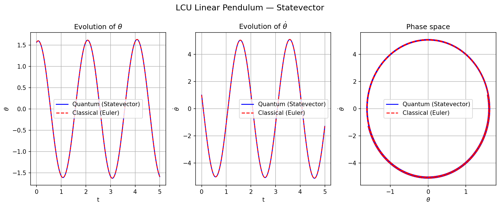
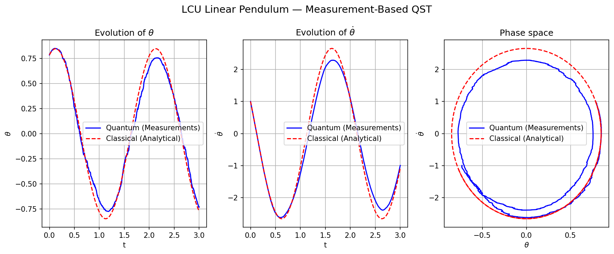

# Pauli-LCU: Linear Pendulum Solver

This directory implements the **Linear Combination of Unitaries (LCU)** algorithm for solving the harmonic oscillator (linear pendulum) equation:

$$\ddot{x} + \omega^2 x = 0$$

## 1. Algorithm Overview

The solver discretizes the ODE using the **Forward Euler** method:

$$x_{n+1} = x_n + \Delta t \, y_n$$
$$y_{n+1} = y_n - \Delta t \, \omega^2 x_n$$

The transition is mapped to a matrix multiplication $\mathbf{v}_{n+1} = A \mathbf{v}_n$, where:

$$A = \begin{pmatrix} 1 & \Delta t \\ -\Delta t \omega^2 & 1 \end{pmatrix}$$

### 1.1 LCU Decomposition
The matrix $A$ is decomposed into a sum of 3 unitary Pauli operators:
$$A = c_0 I + c_1 (\pm X) + c_2 (ZX)$$

The circuit uses 2 ancilla qubits to prepare the superposition of these operators and 1 system qubit to store the state.

## 2. Implementation Modes

### 2.1 Statevector (`pauli_lcu_linear_statevector.py`)
- Uses exact quantum statevector evolution.
- Reconstructs the state via ancilla post-selection.
- **Result**: Matches the classical Euler trajectory with machine precision ($10^{-15}$), validating the circuit logic.

### 2.2 Measurement-Based (`pauli_lcu_linear_measurements.py`)
- Models a NISQ device using stochastic sampling.
- Reconstructs variables via **Quantum State Tomography (QST)**.
- **Observed Effect**: Spiritual decay of the trajectory due to the cumulative post-selection success probability $P \approx 1/\lambda^2 < 1$.

## 3. Results

### Statevector (Exact)


### Measurements (Noisy)


## 4. Usage

```bash
# Run exact simulation
python -m pendulum.pauli_lcu_linear.pauli_lcu_linear_statevector

python -m pendulum.pauli_lcu_linear.pauli_lcu_linear_measurements
```

## 4. References

1. **Childs, A. M. & Wiebe, N.** (2012). *Hamiltonian simulation using linear combinations of unitary operations*. Quantum Information & Computation, 12(11-12), 901-924. [arXiv:1202.5822](https://arxiv.org/abs/1202.5822)
2. **Berry, D. W., Childs, A. M., Cleve, R., Kothari, R., & Somma, R. D.** (2015). *Simulating Hamiltonian dynamics with a truncated Taylor series*. Physical Review Letters, 114(9), 090502. [arXiv:1412.4687](https://arxiv.org/abs/1412.4687)
3. **Nielsen, M. A. & Chuang, I. L.** (2010). *Quantum Computation and Quantum Information*. Cambridge University Press.
