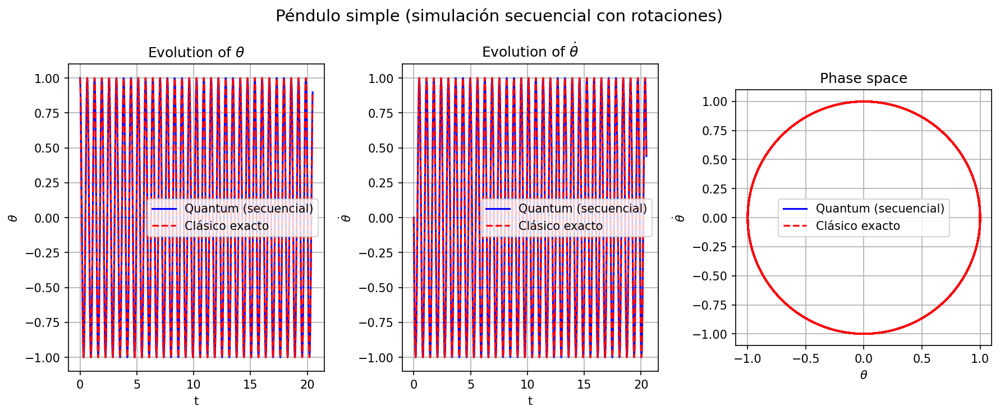
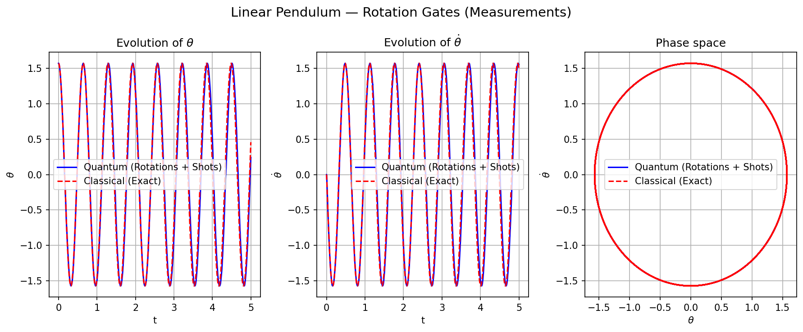

# Rotation Gates: Linear Pendulum Solver

This directory implements the linear pendulum simulation using native **unitary rotation gates** on a 1-qubit register.

## 1. Unitary Mapping

Because the linear pendulum's phase space is circular ($x^2 + y^2 = 1$ in scaled coordinates), its time evolution is a pure rotation in $\mathbb{R}^2$. This is naturally mapped to a single-qubit unitary gate:

$$ U(\Delta \theta) = \exp(-i \sigma_y \Delta \theta) = \begin{pmatrix} \cos(\Delta \theta) & -\sin(\Delta \theta) \\ \sin(\Delta \theta) & \cos(\Delta \theta) \end{pmatrix} $$

where $\Delta \theta = - \omega \Delta t$.

### 1.1 Advantages
- **Strict Unitarity**: Unlike LCU or Block Encoding, this method has a success probability of $P=1$ (no post-selection or ancilla overhead).
- **Conserved Norm**: The quantum state naturally stays on the unit circle, matching the conservation of energy in the ideal linear pendulum.

## 2. Implementation Modes

### 2.1 Statevector (`rotations_linear_statevector.py`)
- Simulates the exact unitary rotation.
- Demonstrates perfect energy conservation across many cycles.

### 3. Quantum State Tomography (QST) for 1 Qubit

Since a quantum computer does not allow direct access to the state amplitudes, the measurement-based solver (`measurements.py`) reconstructs the state $(\theta, \dot{\theta})$ using a two-basis tomography protocol:

1.  **Magnitude Reconstruction (Z-Basis)**:
    Measuring the qubit in the computational basis $\{|0\rangle, |1\rangle\}$ yields the probabilities $P(0)$ and $P(1)$. Based on Born's rule, the magnitudes of the state components are:
    $$|x| = \sqrt{P(0)}, \quad |y| = \sqrt{P(1)}$$
2.  **Sign/Phase Reconstruction (X-Basis)**:
    Z-basis measurements destroy phase information (signs). To recover the relative sign between $x$ and $y$, the qubit is rotated into the X-basis using a Hadamard gate ($H$) before measurement. The expectation value $\langle X \rangle = (c_0 - c_1)/N_{shots}$ determines if the velocity is positive or negative relative to the position.
3.  **Global Phase Heuristic**:
    $1$-qubit tomography has a global $\pm 1$ ambiguity. We resolve this by applying a **Spatial Continuity Heuristic**: the result is compared to the classical one-step Euler prediction, and the global sign that minimizes the Euclidean distance is selected.

## 4. Results

### Statevector (Exact)


### Measurements (Noisy)


## 5. Usage

```bash
python -m pendulum.rotations_linear.rotations_linear_measurements
```

## 4. References

1. **Nielsen, M. A. & Chuang, I. L.** (2010). *Quantum Computation and Quantum Information*. Cambridge University Press. (Ch. 4: Basic unitary gates and circuit construction).
2. **Born, M.** (1926). *Zur Quantenmechanik der Stossvorgange*. Zeitschrift fur Physik, 37(12), 863-867. (Foundation for amplitude reconstruction from shot statistics).
3. **Qiskit Contributors.** (2023). *Qiskit: An open-source framework for quantum computing*. [doi:10.5281/zenodo.2573505](https://doi.org/10.5281/zenodo.2573505)
