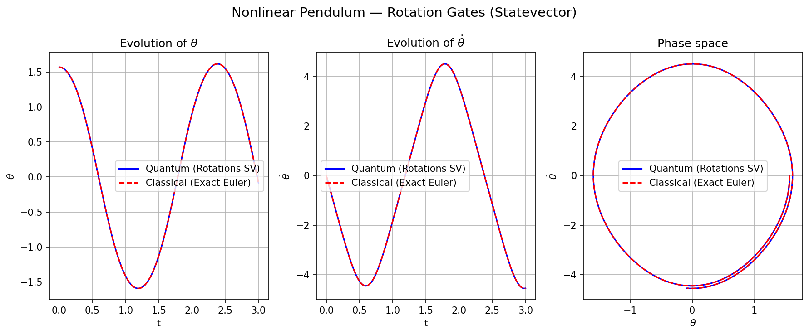
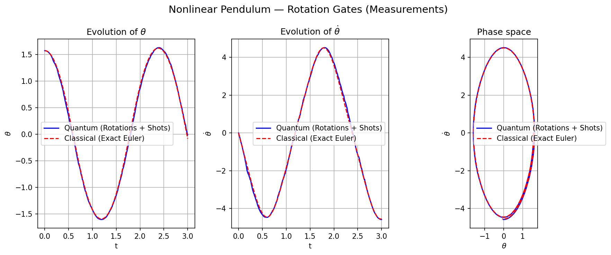

# Rotation Gates: Nonlinear Pendulum Solver

This directory implements a **hybrid quantum-classical algorithm** for the nonlinear pendulum.

## 1. The Challenge of Non-Unitarity

The nonlinear pendulum phase space is not circular; trajectories are elongated (pendular) or open (rotational) and do not strictly conserve the $L_2$ norm on a single 2D plane. Since quantum gates are strictly unitary, they cannot naturally describe this "amplitude stretch" on a single qubit.

## 2. Hybrid Quantum-Classical Strategy

The nonlinearity ($\sin \theta$) is resolved through a **step-by-step delegation** protocol:

1.  **Classical Nonlinearity Handling**: At each time-step $dt$, the classical processor takes the current measured state $\theta_n$ and computes the physically accurate non-linear force $f = \sin(\theta_n)$. 
2.  **Phase Translation**: Using this classical result, it calculates the **target geometric coordinate** $(\theta_{target}, \dot{\theta}_{target})$ in the phase space.
3.  **Unitary Rotation Mapping**: The computer converts this "move" into a single geometric rotation angle $\Delta \phi$. Even though the physics is non-linear, the quantum gate itself is a simple, linear `Ry` rotation that executes the precise angular shift requested by the classical host.
4.  **Norm Rescaling**: Since unitary gates strictly conserve $x^2 + y^2 = 1$ but the physical pendulum's amplitude changes in the Euler discretization, we **track the physical norm classically**. The quantum measurement provides the data on the unit circle, which is then re-scaled to the correct energy level (radius).

## 3. Quantum State Tomography (QST) for 1 Qubit

The measurement-based solver reconstructs the complex state amplitudes using two different projections:

*   **Z-Basis (Magnitudes)**: $\{|0\rangle, |1\rangle\}$ measurements provide $|x|$ (position) and $|y|$ (velocity).
*   **X-Basis (Relative Sign)**: A Hadamard-preceded measurement allows estimating $\langle X \rangle$, which is used to determine if the pendulum is moving "up" or "down" relative to its position.
*   **Sign Recovery Heuristic**: To prevent spurious state flips due to global phase ambiguity, the algorithm uses **Eulerian Continuity**: the global sign $(\pm)$ is chosen by minimizing the distance to the classically predicted next step.

## 4. Implementation Modes

### 3.1 Statevector (`rotations_nonlinear_statevector.py`)
- Demonstrates how the hybrid approach matches the exact Euler trajectory.

### 3.2 Measurement-Based (`rotations_nonlinear_measurements.py`)
- Reconstructs variables via QST with finite shots.
- Evaluates the stability of the hybrid normalization under stochastic sampling noise.

## 5. Results

### Statevector (Exact)


### Measurements (Noisy)


## 6. Usage

```bash
python -m pendulum.rotations_nonlinear.rotations_nonlinear_measurements
```

## 5. References

1. **Nielsen, M. A. & Chuang, I. L.** (2010). *Quantum Computation and Quantum Information*. Cambridge University Press. (Ch. 4: Basic unitary gates and circuit construction).
2. **Liu, J.-P., Kolden, H. O., Krovi, H. K., Loureiro, N. F., Trivisa, K., & Childs, A. M.** (2021). *Efficient quantum algorithm for dissipative nonlinear differential equations*. Proceedings of the National Academy of Sciences, 118(35). [arXiv:2011.03185](https://arxiv.org/abs/2011.03185) (Theoretical motivation for nonlinear ODE solvers on quantum hardware).
3. **Giovannetti, V., Lloyd, S., & Maccone, L.** (2011). *Advances in quantum metrology*. Nature Photonics, 5(4), 222-229. (Context for hybrid quantum-classical state estimation).
